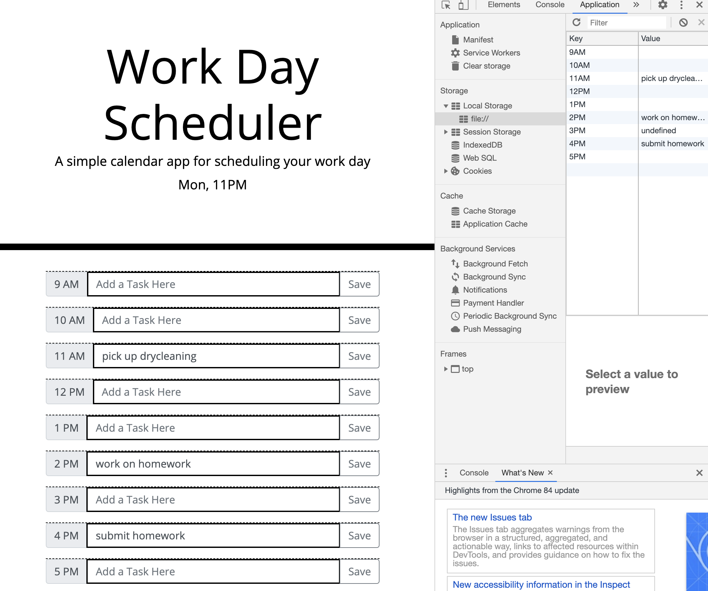

# Bootcamp-Week-5

##Screenshot of Website

## Link to Live

https://github.com/marcos-cmd/day-planner

## GitHub URL

https://marcos-cmd.github.io/day-planner/

## Functions of Day Planner
1. Displays current time
2. If timeblock is before now, border is black
3. If timeblock is after now, border is green
4. If timeblock is same hour as now, border is red
5. Save button will save input text to local storage
6. Changes input text to the saved text in local storage